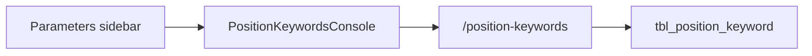

# Position keywords catalog

## Goal

Let admins maintain a list of **position keywords** used in job titles (Supervisor, Officer, Manager, …). Later these will drive an allowance eligibility matrix; this phase is catalog + UI only.



## Defaults

- **Permission:** reuse `canAllowances` (same domain; no new role flag).
- **No workflow:** simple reference data (like jurisdictions), not PENDING/VALIDATE.
- **Nav:** Parameters → **Position keywords** (next to Allowances).
- **Matching / matrix:** out of scope for this phase.

## Data model

New Prisma model in [`schema.prisma`](packages/server/prisma/schema.prisma):

```prisma
model tbl_position_keyword {
  id        String   @id          // short code, e.g. SUPV
  keyword   String                // match text, e.g. Supervisor
  active    Boolean  @default(true)
  createdAt DateTime @default(now())
  updatedAt DateTime @updatedAt

  @@unique([keyword])
  @@index([active])
}
```

Migration under `packages/server/prisma/migrations/`.

Shared types/schemas in [`packages/shared`](packages/shared/src): list DTO + upsert (`id`, `keyword`, `active`).

## API

Mount `/position-keywords` in [`app.ts`](packages/server/src/app.ts), gated by `canAllowances`:

- `GET /` — list (optional `activeOnly`)
- `POST /` — create
- `PUT /:id` — update name/active (id immutable)
- `DELETE /:id` — delete

Service: [`packages/server/src/services/position-keywords.service.ts`](packages/server/src/services/position-keywords.service.ts) + routes file mirroring jurisdictions/org CRUD patterns.

## UI

New [`PositionKeywordsConsole.tsx`](packages/desktop/src/renderer/src/components/PositionKeywordsConsole.tsx) using **CatalogScreen + FormDialog** (same look as Allowances/Roles):

- Search, sortable columns (code, keyword, status), pagination
- Stats (total / active)
- Create/edit dialog: ID, Keyword, Active
- View dialog
- Wire view `position-keywords` in [`AppSidebar.tsx`](packages/desktop/src/renderer/src/components/AppSidebar.tsx) + [`App.tsx`](packages/desktop/src/renderer/src/App.tsx) when `canAllowances`

## Out of scope

- Allowance matrix linking keywords ↔ allowances
- Matching job titles / `jobEng` / designation against keywords
- Workflow validate/reject on keywords
- Uncommenting/using `positionId` on `tbl_allowance_rate`
